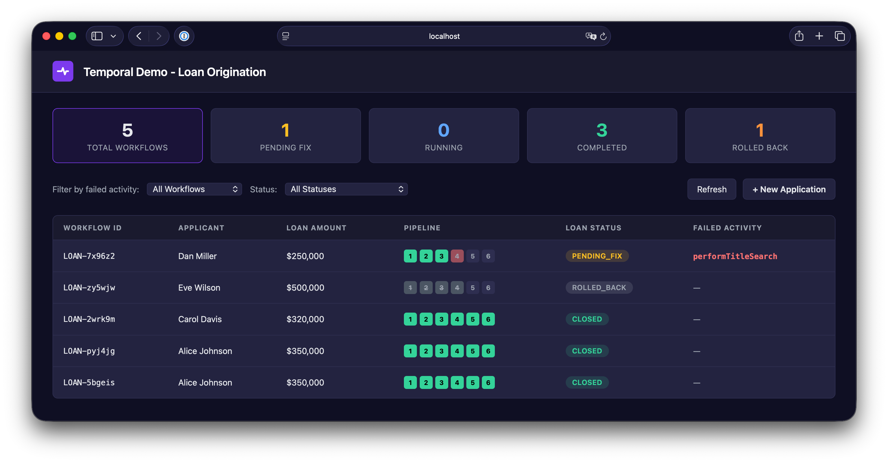

# Loan Origination Demo



Demonstrates two complementary patterns:

1. **Recoverable activity pattern** — failed activities pause the workflow and wait for a human to fix the data via a Temporal Signal before retrying.
2. **Saga / compensation pattern** — when forward progress is not possible (compliance block, applicant withdrawal), the workflow unwinds completed side-effecting steps in LIFO order. Compensations that fail themselves enter the same pause-and-fix loop.

Inspired by [temporal-training-exercise-typescript/solution7](https://github.com/temporal-sa/temporal-training-exercise-typescript/blob/main/solution7/src/workflow.ts) and the [saga pattern guide](https://taonic.github.io/temporal-design-patterns/saga-pattern.html).

## Recoverable pattern

A `recoverableStep` helper wraps each activity:

```typescript
while (true) {
  try {
    return await fn();
  } catch (e) {
    updateStatus('PENDING_FIX', activityName, message);
    retryRequested = false;
    await condition(() => retryRequested);   // wait for signal
  }
}
```

When an activity fails:
1. Status is set to `PENDING_FIX` with the failed activity name and error message
2. Search attributes are updated so the workflow is discoverable via visibility queries
3. The workflow **blocks** until a `retry` signal arrives with corrected data
4. The activity is retried with the patched application data

## Saga pattern

Each step that produces an external side effect registers a compensation **before** it executes. Registrations go onto a LIFO stack via `unshift()`. When the forward pipeline aborts — either a `RollbackRequired` failure from an activity or a `cancelApplication` signal — the catch block unwinds the stack, running each compensation through the same `recoverableStep` wrapper. A compensation that fails (e.g. vendor outage) enters `ROLLBACK_PENDING_FIX`, awaiting either a data patch or a plain retry signal.

Which steps compensate:

| Step | Side effect | Compensation |
|------|------|------|
| `verifyIncome` | Read-only | *(none)* |
| `runCreditCheck` | Hard inquiry on credit bureau | `withdrawCreditInquiry` |
| `orderAppraisal` | Appraiser booking + fee | `cancelAppraisal` |
| `performTitleSearch` | Title company fee + placeholder | `releaseTitleHold` |
| `underwrite` | Reserved lending capacity | `releaseUnderwritingReservation` |
| `closeLoan` | Funds disbursed + lien recorded | `reverseLoanClosure` |

Compensations are **idempotent** — registering before execution means they may be invoked even if the forward step never landed. The workflow skips compensations whose forward step never entered `completedActivities` as an optimization, but safety depends on idempotency, not this check.

After the compensation loop, a `notifyApplicantCancelled` activity runs to tell the customer the application was withdrawn. It runs through the same recoverable wrapper so a transient email outage pauses with `ROLLBACK_PENDING_FIX` rather than leaving the applicant uninformed.

## Home Loan Pipeline

The workflow processes a loan application through 6 sequential activities:

```
Verify Income → Credit Check → Appraisal → Title Search → Underwriting → Close Loan
```

Each activity validates its inputs and throws `ApplicationFailure.nonRetryable()` on bad data, triggering the recovery loop.

## Failure Scenarios

The client starts 11 workflows covering both recovery and saga cases:

### Single-issue (recovery)

| Workflow | Applicant | Fails At | Root Cause |
|----------|-----------|----------|------------|
| LOAN-001 | Alice Johnson | *(none)* | Clean run — all steps pass |
| LOAN-002 | Bob Smith | `runCreditCheck` | Invalid SSN `000-00-0000` |
| LOAN-003 | Carol Davis | `orderAppraisal` | Property address is `INVALID_ADDRESS` |
| LOAN-004 | Dan Miller | `performTitleSearch` | Property ID is `MISSING` |
| LOAN-005 | Eve Wilson | `underwrite` | DTI ratio 1089% exceeds 400% limit |
| LOAN-006 | Frank Brown | `verifyIncome` | Employer `UNKNOWN_EMPLOYER` not in database |

### Multi-issue (require multiple rounds of Patch and Retry)

| Workflow | Applicant | Fails At (in sequence) |
|----------|-----------|------------------------|
| LOAN-007 | Grace Lee | `verifyIncome` → `orderAppraisal` → `performTitleSearch` |
| LOAN-008 | Henry Park | `runCreditCheck` → `underwrite` |
| LOAN-009 | Irene Tanaka | `verifyIncome` → `runCreditCheck` → `orderAppraisal` → `underwrite` |

### Saga (compensation-based rollback)

| Workflow | Applicant | Trigger | Behavior |
|----------|-----------|---------|----------|
| LOAN-010 | Judy Reed | OFAC hit (SSN starts `999`) at `underwrite` | Auto-rolls back credit/appraisal/title compensations in LIFO order |
| LOAN-011 | Kevin Liu | OFAC hit + `APPRAISER_OFFLINE` in address | Rollback reaches `cancelAppraisal`, fails, enters `ROLLBACK_PENDING_FIX` — patch `propertyAddress` to finish the unwind |

You can also cancel any running workflow from the UI's **Cancel Application** button to trigger the same saga unwind with a custom reason.

## UI

A Temporal-branded dashboard at `http://localhost:3000` with:

- **Stats bar** — clickable cards for total, pending fix, running, completed, and rolled-back counts; click to filter the table
- **Pipeline visualization** — 6-step indicator per workflow: green (done), red (forward failure), amber pulse (compensating), amber-ringed red (rollback stuck), gray-strike (compensated), gray (pending)
- **Filter by failed activity / status** — includes rollback states (`COMPENSATING`, `ROLLBACK_PENDING_FIX`, `ROLLED_BACK`)
- **Patch and Retry** — patch a bad field and retry the failed activity; suggested fix is context-aware (different suggestions for forward failures vs. stuck compensations)
- **Cancel Application** — triggers the saga unwind with an operator-supplied reason; shows the count of compensatable steps
- **Retry Compensation** — during `ROLLBACK_PENDING_FIX`, resubmit with no patch (vendor came back) or patch a field and retry
- **Fix history / Compensation history** — two separate audit tables; compensation entries display both the forward step and the compensation activity name
- **Rollback reason banner** — shows the original trigger (OFAC hit, operator cancellation, etc.) throughout the saga lifecycle
- **Temporal UI link** — each workflow modal links directly to the workflow in Temporal UI (`localhost:8233`)
- **Auto-polling** — dashboard refreshes every 3 seconds; modal polls every 1 second after sending a fix or cancellation until a terminal or paused state is reached

## Prerequisites

- Temporal Server running locally on `localhost:7233`
- Node.js 18+

## Setup

```bash
npm install
```

Start the Temporal dev server with the custom search attributes provisioned in one command:

```bash
temporal server start-dev \
  --search-attribute LoanStatus=Keyword \
  --search-attribute FailedActivity=Keyword
```

If the dev server is already running, register them via the operator command instead:

```bash
temporal operator search-attribute create --name LoanStatus --type Keyword
temporal operator search-attribute create --name FailedActivity --type Keyword
```

## Running

```bash
# Terminal 1: Start the worker
npm start

# Terminal 2: Start 9 loan workflows with different failure scenarios
npm run workflow

# Terminal 3: Start the UI
npm run web
# Open http://localhost:3000
```

## Fixing a Failed Workflow

From the UI:
1. Click a workflow in `PENDING_FIX` state
2. See the error message, current value, and suggested fix
3. Select the field to patch, enter the corrected value
4. Click **Patch and Retry**
5. Watch the spinner and pipeline update in real-time as the workflow resumes

You can also start new workflows directly from the UI using the **+ New Application** button, with a scenario dropdown to inject specific failures.

From the CLI:
```bash
# Patch and retry a forward failure or a stuck compensation
temporal workflow signal \
  --workflow-id LOAN-002 \
  --name retry \
  --input '{"key":"ssn","value":"222-33-4444"}'

# Retry a stuck compensation without patching (vendor is back)
temporal workflow signal \
  --workflow-id LOAN-011 \
  --name retry \
  --input '{}'

# Cancel an application and trigger saga rollback
temporal workflow signal \
  --workflow-id LOAN-001 \
  --name cancelApplication \
  --input '{"reason":"Applicant withdrew offer"}'
```

## Searching for Failed Workflows

The workflow updates `LoanStatus` and `FailedActivity` search attributes, making them queryable:

```bash
# Find all workflows stuck at credit check
temporal workflow list --query "FailedActivity = 'runCreditCheck'"

# Find all workflows pending fix
temporal workflow list --query "LoanStatus = 'PENDING_FIX'"
```

## Project Structure

```
src/
├── models.ts        # LoanApplication, LoanState, FixEntry, CompensationEntry, CancelRequest types
├── activities.ts    # 6 forward + 5 compensation + 1 post-rollback notification activity
├── workflows.ts     # homeLoanWorkflow with recoverableStep, LIFO saga stack, cancel signal
├── worker.ts        # Worker on 'recoverable-activity' task queue
├── client.ts        # Starts 11 workflows (recovery + saga scenarios)
└── web-service.ts   # Express API: list, search, query, signal, start, cancel
public/
└── index.html       # Temporal-branded Vue.js 3 dashboard
```
