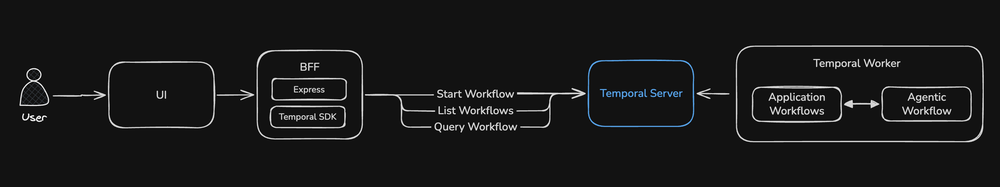

# Loan Origination Demo

<video src="https://github.com/user-attachments/assets/59d8d575-04fb-45dd-8f01-400234eaca02" poster="assets/list-view.png" autoplay muted loop playsinline controls width="100%"></video>

Demonstrates four complementary patterns on Temporal:

1. **Recoverable activity pattern** — failed activities pause the workflow and wait for a human to fix the data via a Temporal Signal before retrying.
2. **Saga / compensation pattern** — when forward progress is not possible (compliance block, applicant withdrawal), the workflow unwinds completed side-effecting steps in LIFO order. Compensations that fail themselves enter the same pause-and-fix loop.
3. **Durable agent pattern** — an LLM-driven underwriter runs as a child workflow. Each model call and each tool invocation is its own activity, so the tool-use loop is durable, replayable, and inspectable in the Temporal UI.
4. **Human-in-the-loop approval** — after the AI agent review, the workflow blocks on `PENDING_APPROVAL` until an operator approves (complete) or rejects (notify applicant, terminate in `REJECTED`) from a workflow-scoped approval page.

Inspired by [temporal-training-exercise-typescript/solution7](https://github.com/temporal-sa/temporal-training-exercise-typescript/blob/main/solution7/src/workflow.ts) and the [saga pattern guide](https://taonic.github.io/temporal-design-patterns/saga-pattern.html).

## Quick start

Needs Node.js 18+, the [Temporal CLI](https://docs.temporal.io/cli#install), and Docker (for local Ollama).

```bash
npm install

./run.sh          # terminal 1 — Ollama + Temporal dev server + web service
./run-worker.sh   # terminal 2 — the worker
```

Open the dashboard at **http://localhost:3000** and seed the demo with the **+ New Application** button, or from the CLI:

```bash
npx ts-node src/client.ts   # 11 loan workflows covering every failure scenario
```

First run pulls the `qwen2.5:1.5b` model (~1GB), so give it a few minutes. See [Running](#running) for details.

## Architecture



The Vue.js dashboard talks to an Express BFF ([src/web-service.ts](src/web-service.ts)), which holds the Temporal Client. It starts workflows, lists them via visibility queries, and reads live state through workflow queries and signals — no separate database. The Temporal Worker ([src/worker.ts](src/worker.ts)) hosts both the application workflow ([src/workflows.ts](src/workflows.ts)) and the agentic child workflow ([src/agent-workflow.ts](src/agent-workflow.ts)), plus their activity modules, on a single task queue.

## Recoverable pattern

A `recoverableStep` helper wraps each activity:

```typescript
while (true) {
  try {
    return await fn();
  } catch (e) {
    updateStatus('PENDING_FIX', activityName, message);
    retryRequested = false;
    await condition(() => retryRequested);   // wait for signal
  }
}
```

When an activity fails:
1. Status is set to `PENDING_FIX` with the failed activity name and error message
2. Search attributes are updated so the workflow is discoverable via visibility queries
3. The workflow **blocks** until a `retry` signal arrives with corrected data
4. The activity is retried with the patched application data

## Saga pattern

Each step that produces an external side effect registers a compensation **before** it executes. Registrations go onto a LIFO stack via `unshift()`. When the forward pipeline aborts — a `RollbackRequired` failure from an activity, a `cancelApplication` signal, or cancellation of the agent child workflow — the catch block unwinds the stack, running each compensation through the same `recoverableStep` wrapper. A compensation that fails (e.g. vendor outage) enters `ROLLBACK_PENDING_FIX`, awaiting either a data patch or a plain retry signal.

Which steps compensate:

| Step | Side effect | Compensation |
|------|------|------|
| `verifyIncome` | Read-only | *(none)* |
| `runCreditCheck` | Hard inquiry on credit bureau | `withdrawCreditInquiry` |
| `orderAppraisal` | Appraiser booking + fee | `cancelAppraisal` |
| `underwrite` | Reserved lending capacity | `releaseUnderwritingReservation` |
| `agentReview` | Read-only (LLM + info tools) | *(none)* |
| `humanApproval` | Read-only (pause for operator) | *(none)* |

Compensations are **idempotent** — registering before execution means they may be invoked even if the forward step never landed. The workflow skips compensations whose forward step never entered `completedActivities` as an optimization, but safety depends on idempotency, not this check.

After the compensation loop, a `notifyApplicantCancelled` activity runs to tell the customer the application was withdrawn. It runs through the same recoverable wrapper so a transient email outage pauses with `ROLLBACK_PENDING_FIX` rather than leaving the applicant uninformed.

The entire unwind block is wrapped in `CancellationScope.nonCancellable(...)`. If the parent workflow itself receives a Temporal cancellation mid-saga, the compensations still run to completion instead of being aborted — otherwise credit/appraisal/underwriting holds would stay stuck.

## Agentic AI Underwriter

After `underwrite` passes its deterministic DTI/OFAC checks, the parent workflow launches `underwritingAgentWorkflow` as a **child workflow** inside a cancellable scope:

```typescript
agentRecommendation = await CancellationScope.cancellable(async () => {
  agentScope = CancellationScope.current();
  return executeChild(underwritingAgentWorkflow, {
    workflowId: `${app.applicationId}-agent`,
    args: [{ application, creditScore }],
  });
});
```

Running the agent as a child workflow keeps its history separate (cleaner parent history, and ready for `continueAsNew` on long conversations), lets you assign it to a dedicated task queue (e.g. a GPU-backed worker), and surfaces it in the Temporal UI as its own inspectable execution.

Inside the child, the workflow drives a tool-call loop — **not** Vercel AI SDK's built-in `maxSteps` loop, which would collapse the whole agent into a single opaque activity. Each iteration:

1. **LLM activity** (`callAgentLLM`) — wraps `generateText` from the Vercel AI SDK with `maxSteps: 1` and `temperature: 0`, returning the model's tool calls instead of auto-executing them. Uses Temporal's default retry policy (unlimited attempts with exponential backoff) so transient Ollama hiccups — model load stalls, network blips, container restarts — recover automatically. Tradeoff: LLM calls aren't idempotent, so a retry after a late timeout may produce slightly different tool calls than the first attempt would have.
2. **Tool activities** — the workflow dispatches each named tool to its own activity. Three mock read-only tools drive the demo: `lookupFullCreditReport`, `checkComplianceWatchlist`, `getPropertyComparables`.
3. **Termination** — the model has no terminal tool. When it stops emitting tool calls and replies with plain text, the workflow parses a `DECISION: / CONFIDENCE: / RATIONALE:` block out of the reply and returns a structured `AgentRecommendation`. This matches what small models actually do reliably; forcing a `submitRecommendation` tool call was unreliable on `qwen2.5:1.5b`.

### Cancellation

The agent child can be cancelled in two ways and both reach the same end state — saga unwind in the parent:

- **Operator cancels the child directly** (e.g. `temporal workflow cancel --workflow-id LOAN-001-<batch>-agent`). The parent's `executeChild` throws, `isCancellation(err)` catches it, and the parent rethrows to its outer catch block which runs the saga compensations.
- **Operator sends `cancelApplication` to the parent** while the agent is mid-flight. The signal handler calls `agentScope?.cancel()`, propagating cancellation *down* into the child. The child terminates, `executeChild` throws `CancelledFailure`, and the same path runs. Without the cancellable scope, the parent would have to wait for the agent to complete naturally before noticing the flag.

Guardrails:

- `MAX_TURNS = 15` hard cap → ESCALATE if the model gets stuck looping.
- Unknown tool names are fed back as a structured error so the model can self-correct.
- If Ollama is unreachable, the parent workflow catches the child failure and records an `ESCALATE` recommendation — the human approver still sees something meaningful. Cancellations are distinguished from other child failures via `isCancellation(err)`.

The recommendation is surfaced on both the dashboard modal and the approval page, including the full tool-call trace.

### LLM runtime

Runs against a **local Ollama** instance. A `docker-compose.yml` stands up Ollama and pulls the model via a one-shot sidecar. Default model is `qwen2.5:1.5b` (~1GB) — the smallest Qwen 2.5 with reasonably reliable tool calling for a demo. `qwen2.5:0.5b` (~400MB) is the smallest Ollama model that officially supports tools but is too flaky for multi-turn loops (frequent ESCALATEs). Bump to `qwen2.5:3b` (~2GB) or `qwen2.5:7b` (~4.7GB) for more reliable multi-turn tool JSON at the cost of CPU inference time.

Override either via env:

```bash
OLLAMA_BASE_URL=http://localhost:11434/api
AGENT_MODEL=qwen2.5:1.5b
```

On macOS, Docker Desktop can't pass through Metal GPU — Ollama in Docker runs CPU-only. For snappier demos, `brew install ollama` and point the worker at the host instance instead.

## Human-in-the-loop Approval

After the AI agent review, the workflow sets status to `PENDING_APPROVAL` and blocks on a condition that wakes on either an `approveApplication` signal or a `cancelApplication` signal:

```typescript
updateStatus('PENDING_APPROVAL');
await condition(() => approvalRequested || cancelRequested);
if (cancelRequested) {
  notificationMessage = await notifyApplicantCancelled(...);
  updateStatus('REJECTED', '', cancelReason);
} else {
  completedActivities.push('humanApproval');
  updateStatus('APPROVED');
}
```

The dashboard modal shows an **Open Approval Page ↗** link that opens `/approve.html?id=<workflowId>` in a new tab. That page displays the loan details plus the AI underwriter's recommendation and tool-call trace, and offers:

- **Approve** → sends `approveApplication` signal → workflow completes in `APPROVED`.
- **Reject** (with required reason) → sends `cancelApplication` signal → workflow notifies the applicant and completes in `REJECTED`. No saga unwind — earlier holds (credit, appraisal, underwriting reservation) stay committed per business policy.

## Home Loan Pipeline

The workflow processes a loan application through 6 sequential activities:

```
Verify Income → Credit Check → Appraisal → Underwriting
  → AI Agent Review (child workflow) → Human Approval
```

Each forward activity validates its inputs and throws `ApplicationFailure.nonRetryable()` on bad data, triggering the recovery loop.

## Failure Scenarios

`src/client.ts` starts 11 workflows covering both recovery and saga cases:

### Single-issue (recovery)

| Workflow | Applicant | Fails At | Root Cause |
|----------|-----------|----------|------------|
| LOAN-001 | Alice Johnson | *(none)* | Clean run — all steps pass |
| LOAN-002 | Bob Smith | `runCreditCheck` | Invalid SSN `000-00-0000` |
| LOAN-003 | Carol Davis | `orderAppraisal` | Property address is `INVALID_ADDRESS` |
| LOAN-005 | Eve Wilson | `underwrite` | DTI ratio 1089% exceeds 400% limit |
| LOAN-006 | Frank Brown | `verifyIncome` | Employer `UNKNOWN_EMPLOYER` not in database |

### Multi-issue (require multiple rounds of Patch and Retry)

| Workflow | Applicant | Fails At (in sequence) |
|----------|-----------|------------------------|
| LOAN-007 | Grace Lee | `verifyIncome` → `orderAppraisal` |
| LOAN-008 | Henry Park | `runCreditCheck` → `underwrite` |
| LOAN-009 | Irene Tanaka | `verifyIncome` → `runCreditCheck` → `orderAppraisal` → `underwrite` |

### Saga (compensation-based rollback)

| Workflow | Applicant | Trigger | Behavior |
|----------|-----------|---------|----------|
| LOAN-010 | Judy Reed | OFAC hit (SSN starts `999`) at `underwrite` | Auto-rolls back credit/appraisal compensations in LIFO order |
| LOAN-011 | Kevin Liu | OFAC hit + `APPRAISER_OFFLINE` in address | Rollback reaches `cancelAppraisal`, fails, enters `ROLLBACK_PENDING_FIX` — patch `propertyAddress` to finish the unwind |

You can also cancel any running workflow from the UI's **Cancel Application** button to trigger the same saga unwind with a custom reason.

## UI

A Temporal-branded dashboard at `http://localhost:3000` with:

- **Stats bar** — clickable cards for total, pending fix, running, awaiting approval, approved, and rolled-back counts; click to filter the table
- **Pipeline visualization** — 6-step indicator per workflow: green (done/approved), red (forward failure or rejected), amber pulse (compensating), amber-ringed red (rollback stuck), gray-strike (compensated), cyan pulse (awaiting approval), gray (pending)
- **AI underwriter recommendation card** — shows decision (APPROVE/DECLINE/ESCALATE), confidence, model, turn count, rationale, and collapsible tool-call trace; header links to the child agent workflow in Temporal UI
- **Filter by failed activity / status** — includes `AGENT_REVIEWING`, `PENDING_APPROVAL`, `APPROVED`, `REJECTED`, and rollback states
- **Patch and Retry** — patch a bad field and retry the failed activity; suggested fix is context-aware (different suggestions for forward failures vs. stuck compensations)
- **Cancel Application** — triggers the saga unwind with an operator-supplied reason; shows the count of compensatable steps
- **Retry Compensation** — during `ROLLBACK_PENDING_FIX`, resubmit with no patch (vendor came back) or patch a field and retry
- **Approval page** — `/approve.html?id=<workflowId>` opens in a new tab from the modal; shows loan details, AI recommendation, and Approve / Reject buttons. Reject requires a reason and notifies the applicant without running the saga.
- **Fix history / Compensation history** — separate audit tables; compensation entries display both the forward step and the compensation activity name
- **Rollback reason banner** — shows the original trigger (OFAC hit, operator cancellation, etc.) throughout the saga lifecycle
- **Temporal UI link** — each workflow modal links to the parent workflow in Temporal UI (`localhost:8233`); agent card links to the child workflow
- **Auto-polling** — dashboard refreshes every 3 seconds; modal polls every 1 second after sending a fix/cancel/approval until a terminal or paused state is reached

Child `underwritingAgentWorkflow` executions are hidden from the dashboard list (`WorkflowType = 'homeLoanWorkflow'` is added to the visibility query), so the table shows only parent loan workflows.

## Running

### Prerequisites

- Node.js 18+
- [Temporal CLI](https://docs.temporal.io/cli#install) (`temporal`) on your `PATH`
- Docker (for local Ollama via `docker-compose.yml`), or a native Ollama install

### Why two terminals

`run.sh` brings up the infrastructure and the UI; `run-worker.sh` runs the worker separately so you can restart it independently while iterating on workflow/activity code — and so you can Ctrl-C it mid-run to demo crash-proof workflows resuming where they left off.

### What `run.sh` does

1. If Temporal (`:7233`) or Ollama (`:11434`) is already running, it prompts to reuse the existing instance; otherwise it frees the port and starts a fresh one.
2. Frees ports 3000 (web UI) and 3001 (iframe-friendly Temporal UI proxy).
3. Starts Ollama via `docker compose up -d` — this also pulls the model on first run (~1GB for the default `qwen2.5:1.5b`), so the first start takes a few minutes.
4. Starts `temporal server start-dev` **detached**, with the `LoanStatus` and `FailedActivity` keyword search attributes provisioned:

   ```bash
   temporal server start-dev \
     --search-attribute LoanStatus=Keyword \
     --search-attribute FailedActivity=Keyword
   ```

5. Starts the web service (`npm run web`) and waits for :3000.

Ctrl-C stops the web service and, if `run.sh` started the Ollama container, tears it down too. The **Temporal dev server is deliberately left running** so workflow histories survive a restart of the app — stop it manually (`kill $(lsof -ti tcp:7233)`) when you want a clean slate.

Logs from the backgrounded processes land in `logs/`: `ollama.log`, `temporal.log`, `web.log`.

`run-worker.sh` is a thin wrapper: it checks that Temporal is up on :7233 and then execs `npm run worker` in the foreground, so worker logs stay on your terminal and Ctrl-C restarts just the worker (nodemon is not used here — restart the script after code changes, or use `npm run worker.watch`).

### Endpoints

| Service | URL |
|---------|-----|
| Dashboard | http://localhost:3000 |
| Temporal UI | http://localhost:8233 |
| Temporal UI proxy (iframe) | http://localhost:3001 |
| Ollama | http://localhost:11434 |

### Running the pieces manually

If you'd rather not use the scripts:

```bash
npm run llm     # docker compose up — Ollama + one-shot model-pull sidecar
npm run worker  # ts-node src/worker.ts
npm run web     # nodemon src/web-service.ts
```

Plus the Temporal dev server with the search attributes as shown above. If a dev server is already running without them, register them via the operator command instead:

```bash
temporal operator search-attribute create --name LoanStatus --type Keyword
temporal operator search-attribute create --name FailedActivity --type Keyword
```

## Fixing a Failed Workflow

From the UI:
1. Click a workflow in `PENDING_FIX` state
2. See the error message, current value, and suggested fix
3. Select the field to patch, enter the corrected value
4. Click **Patch and Retry**
5. Watch the spinner and pipeline update in real-time as the workflow resumes

You can also start new workflows directly from the UI using the **+ New Application** button, with a scenario dropdown to inject specific failures.

From the CLI:
```bash
# Patch and retry a forward failure or a stuck compensation
temporal workflow signal \
  --workflow-id LOAN-002 \
  --name retry \
  --input '{"key":"ssn","value":"222-33-4444"}'

# Retry a stuck compensation without patching (vendor is back)
temporal workflow signal \
  --workflow-id LOAN-011 \
  --name retry \
  --input '{}'

# Approve a workflow at PENDING_APPROVAL
temporal workflow signal \
  --workflow-id LOAN-001 \
  --name approveApplication

# Reject a workflow at PENDING_APPROVAL (notifies applicant, completes as REJECTED)
temporal workflow signal \
  --workflow-id LOAN-001 \
  --name cancelApplication \
  --input '{"reason":"Rejected at approval: policy exception"}'

# Cancel mid-pipeline and trigger saga rollback
temporal workflow signal \
  --workflow-id LOAN-001 \
  --name cancelApplication \
  --input '{"reason":"Applicant withdrew offer"}'
```

## Searching for Failed Workflows

The workflow updates `LoanStatus` and `FailedActivity` search attributes, making them queryable:

```bash
# Find all workflows stuck at credit check
temporal workflow list --query "FailedActivity = 'runCreditCheck'"

# Find all workflows pending fix
temporal workflow list --query "LoanStatus = 'PENDING_FIX'"

# Find all workflows awaiting human approval
temporal workflow list --query "LoanStatus = 'PENDING_APPROVAL'"
```

## Project Structure

```
src/
├── models.ts              # LoanApplication, LoanState, AgentRecommendation, message/content types
├── activities.ts          # 4 forward + 3 compensation + 1 post-rollback notification activity
├── agent-activities.ts    # LLM call (Vercel AI SDK + Ollama) + 3 mock info-tool activities
├── workflows.ts           # homeLoanWorkflow: recoverableStep, LIFO saga stack, approval wait
├── agent-workflow.ts      # underwritingAgentWorkflow child: tool-call loop with MAX_TURNS cap
├── worker.ts              # Worker registers both workflows and both activity modules
├── client.ts              # Starts 11 workflows (recovery + saga scenarios)
└── web-service.ts         # Express API: list, search, query, signal (retry/cancel/approve), start
public/
├── index.html             # Temporal-branded Vue.js 3 dashboard
└── approve.html           # Per-workflow approval page with Approve / Reject actions
docker-compose.yml         # Ollama + one-shot model-pull sidecar
run.sh                     # Ollama + Temporal dev server + web service (logs to logs/)
run-worker.sh              # worker in the foreground
```
